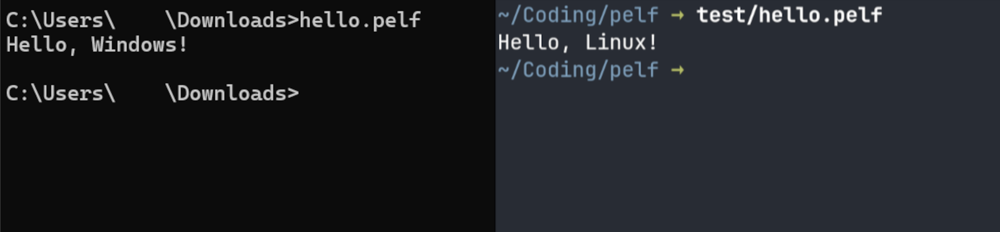

# Portable Executable Linkable Format

a.k.a. PELF, a binary that can run natively on both Windows and Linux!

This project is a file format and corresponding command-line utility that combines a Windows **P**ortable **E**xecutable file (commonly know by its extension .exe) and a Linux **E**xecutable **L**inkable **F**ormat file through a [shebang](https://wikipedia.org/wiki/Shebang_(Unix))-less shell script to make a binary [polyglot](https://wikipedia.org/wiki/Polyglot_\(computing\)) that can run on both Windows and Linux!

## Installation

Go to the latest GitHub release and download `pelf-x86_64-linux`, `pelf-x86_64-windows.exe`, or `pelf-x86_64-windows+linux.pelf` to try it out!

You can also clone the repository and build src/pelf.c yourself, there are no dependencies except libc.

## Usage

Use `pelf file` to combine `file` and `file.exe` into a .pelf, or specify the .exe file and optionally the .pelf file as the second and third argument.

Then, just run `./file.pelf` on Linux or `file.pelf` on Windows!

> [!NOTE]
> Linux users who use systemd and wine may experience interference from `systemd-binfmt.service`. You can mitigate this either by running PELFs with `sh file.pelf` or by stopping the service. 

## How it works

The PELF format takes advantage of the Portable Executable **DOS Stub**, a tiny 128B DOS program present at the start of every .exe file that reminds any user who is still somehow running DOS that they cannot use this program. PELF overwrites this stub with an even tinier shebangless script (less than 56 bytes!) that takes the end of the file after a certain offset, copies it to a new file, marks that file as executable, and simultaneously runs it and deletes it. Then, by concatenating the ELF file at the end of the PE file and setting that offset to be the point where they connect, you have yourself a working PELF!

## Acknowledgements

Although I didn't know about it when I came up with the idea for this project, Justine Tunney's [Actually Portable Executable](https://justine.lol/ape.html) was a big help in figuring out how this format could work out. Although my stub is somewhat different, her approach of a PE and shell script polyglot was the reason I could complete this project.
